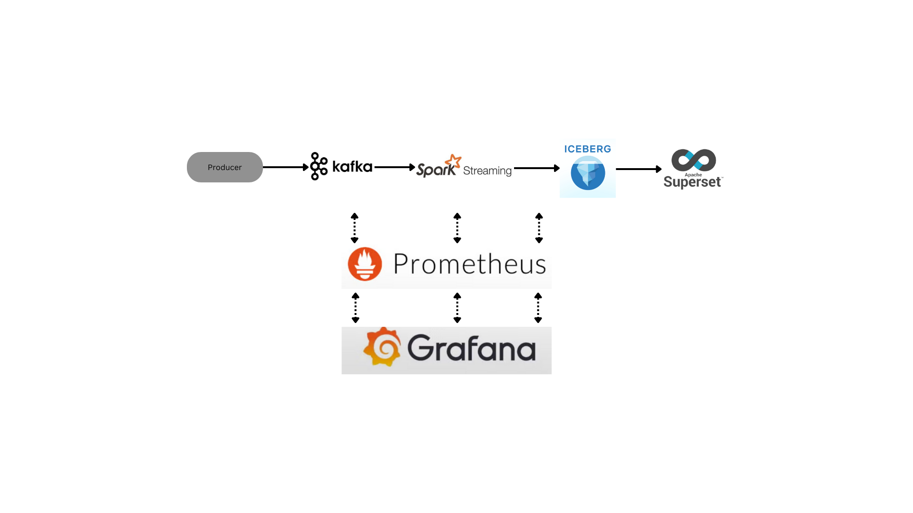

# CryptoLake
This repository is used to create an Iceberg format data lake.
## Tech Stack
1. Kafka
2. Spark Streaming
3. Nessie
4. Iceberg
5. Superset
6. Prometheus
7. Grafana

## Architecture

## Pre requisites
1. Python (> 3.0)
2. Docker

## How to run?
1. Clone the repository to your local system.
2. Create a config file under ``src/config/config.yml``. Add the following
    ````
    crypto:
      api_token: "API_TOKEN"
    ````
Get the API Token from https://min-api.cryptocompare.com/
3. Run ``main.py`` to produce data to the kafka topic. Make sure the Kafka cluster is up and ``crypto`` topic is created on the cluster. More information regarding the cluster can be found under ``src/utilities/enums.py``
4. Make sure Docker Desktop is running and run ``docker-compose build`` and ``docker-compose up`` from `docker/`. This will create the required containers such as spark-iceberg, nessie catalog and runs the spark streaming job. The spark job will write data to iceberg tables.

## TODO
1. Superset
2. Copy source file to container on startup
3. Kafka as a container instead of a separate service